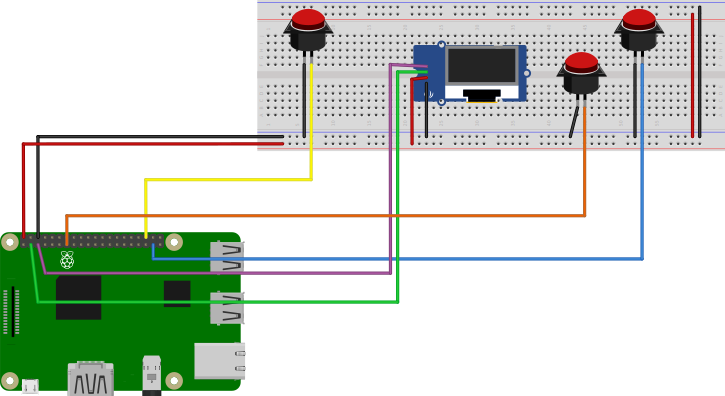

# hackathon-table-tennis-score-pi
A raspi based Table Tennis score recorder


based on: https://github.com/jujhars13/akaal-switch

## Hardware required

- Raspberry Pi B+,Zero, 3, 4 or any internet enabled Pi
- An [I2C](https://i2c.info/) enabled LCD/OLED [like this one](https://www.amazon.co.uk/gp/product/B07PWWTB94/ref=ppx_yo_dt_b_asin_title_o00_s00?ie=UTF8&psc=1)
- Breadboard/circuit board with wires/solder to hole the whole thing together
- Flashing Light - LED with 330Ohm resistor
- 2x Physical push switches

### Wiring Diagram

- LCD i2C SDL - `Board Pin 3`
- LCD i2C SCL - `Board Pin 5`
- Switch PullUp B - `Board Pin 36`
- Switch PullUp A - `Board Pin 37`



## To Deploy

- Ensure you've copied `.env.template` to `.env` and populated the environment variables required.
- Copy `provision-pi.sh` and your populated `.env` to a new [Raspbian Buster](https://www.raspberrypi.org/downloads/raspbian/) `/boot` partition
- Once Pi has finished booting for the first time and you've configured:
  - network(WiFi)
  - ssh auth & security
  - kernel support for the [i2c module](https://learn.adafruit.com/adafruits-raspberry-pi-lesson-4-gpio-setup/configuring-i2c) use `raspi-config`
- Run `provision-pi.sh` as `root`:

  ```bash
  sudo su -
  bash provision-pi.sh
  ```

  This will:
      - Install all deps
      - checkout code to `/opt/hackathon-table-tennis-score`
      - setup updates, reboots etc...
      - setup code to run as daemon (using systemd)
- Remember to populate and copy `.env` to `/opt/hackathon-table-tennis-score` if you have not already done so
- Wire up RasPi as per diagram
- Reboot and Test!

## Todo

### Compulsory

- [x] unwrap and setup pi
- [x] install raspbian
- [x] hook up pi and provision using script
- [x] pull latest code from github at boot (github deploy key)
- [x] draw wiring diagram (fritzing)
- [x] hook up LED response to button press
- [x] take photo of dev setup
- [x] test lcd screen wireup using `i2cdetect -y 1`
- [x] print message to LCD screen
- [ ] wire up buttons and stick to table
- [ ] stick screen and pi to table tennis table
- [ ] take photo of mvp setup
- [ ] ensure pi has autoupdates on
- [ ] deploy prod
    - [ ] test
    - [ ] re-install raspbian lite and redeploy w/ provision script
    - [ ] take photo of final setup
- [ ] Optional
    - [ ] solder on pi zero header pins
    - [ ] solder things up to a board

## Licence

[MIT](LICENCE)
